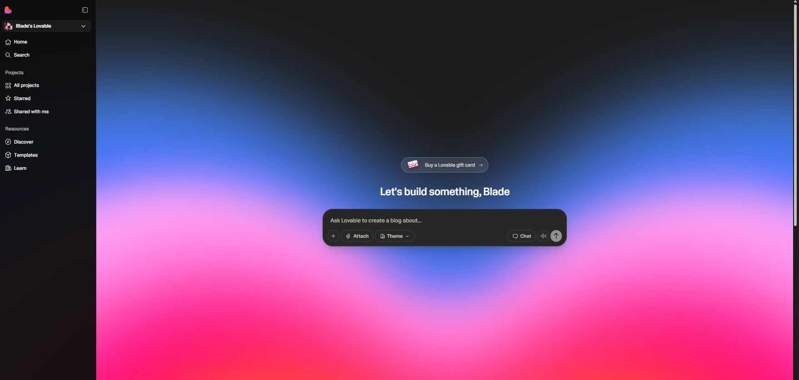
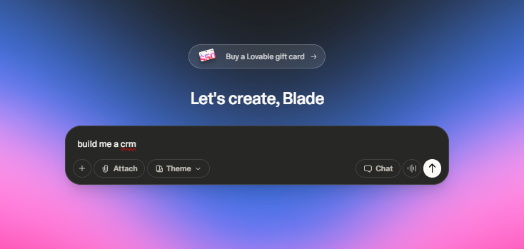
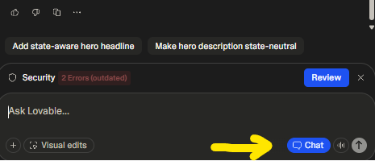

# Lovable – Writing Your First Prompt (Without Overthinking It)

Lovable is an AI app builder that turns a **plain‑English description** of your idea into a working web app – UI, backend, database, hosting, the whole thing. It uses modern tooling under the hood (React, Tailwind, Supabase, GitHub sync, one‑click deploy), but you mostly talk to it in normal language.

This page is about one thing:

> When you see that big box that says  
> **“Ask Lovable to create a ___”**  
> …what should you actually type?

Think of this as a “prompt recipe” so you (or your grandma) can go from *vibes* to something you can actually ship.

---

## 1. Mental model: Lovable as your full‑stack cofounder

When you’re on this screen:

> **“Let’s build something, Blade”**  
> and the big gradient with the input box

…Lovable is basically asking:

> “Describe the app like you would to a friend.  
> I’ll handle the boring boilerplate and wiring.”

Rough split of responsibilities:

- **You**: product brain  
  - Who is this for?  
  - What should they be able to do?  
  - What absolutely has to be on screen?

- **Lovable**: super fast full‑stack engineer
  - Sets up the project, stack, and hosting  
  - Generates the first version of the UI + backend  
  - Applies your changes when you ask for tweaks

So we’re not writing “magic spells.”  
We’re giving clear product specs in casual language.

---

## 2. What a *good* Lovable prompt includes

A great first prompt usually has **4 pieces**:

1. **One‑sentence purpose** – what the app is for  
2. **Who it’s for** – the main user type(s)  
3. **Core objects / data** – the things you’re tracking  
4. **Main screens or flows** – what pages you expect

Here’s a copy‑paste template:

```text
I want to build a simple web app.

Purpose:
- {{what the app helps with}}

Users:
- {{who uses it}} (e.g. freelance designers, barbershop owners, my internal team)

Data we track:
- {{main entities}} (e.g. clients, invoices, appointments, tasks)

Screens / flows:
- {{Screen 1}} – what should be on it
- {{Screen 2}} – what should be on it
- {{Screen 3}} – what should be on it

Stack:
- I'm happy with your default stack, just keep it simple and clean.
```

That’s already enough for Lovable to scaffold a solid first version.

---

## 3. Bad vs better vs great prompts



### Example 1 – Simple CRM for freelancers

**Bad:**

```text
Build me a CRM.
```

Too vague. Hundreds of possible interpretations.

**Better:**

```text
Build me a simple CRM for freelancers.
```

Closer, but still fuzzy.

**Great:**

```text
Build me a simple CRM for freelance designers.

Purpose:
- Keep track of clients and projects in one place.

Users:
- Me (single freelancer, no team).

Data:
- Clients (name, company, email, phone, notes)
- Projects (client, title, status, budget, deadline)

Screens:
- Dashboard: list of active projects with status and upcoming deadlines
- Clients page: list + detail view per client with their projects
- Project detail page: show status, budget, deadline, notes, and a checklist of tasks
```

That’s something Lovable can turn into a usable app on the first try.

---

### Example 2 – Internal tool for tracking referrals

**Bad:**

```text
Make an internal tool for referrals.
```

**Better:**

```text
Make an internal tool to track referrals for my SaaS.
```

**Great:**

```text
I want an internal tool to track merchant referrals for my SaaS product.

Users:
- My team only (no public signups).

Data:
- Referrers (name, email, company, referral code)
- Merchants (name, contact, status, MRR)
- Referrals (which referrer brought which merchant, date, notes)

Screens:
- Referrers list: table with basic info + total merchants + total MRR
- Referrer detail: list of all merchants they referred + totals
- Merchants list: search + filter by status (trial, active, churned)

Extra:
- Simple auth so only my team can log in.
```

Lovable now knows the **shape of your data** and the **screens** you care about.

---

## 4. Prompts that play nicely with Lovable

Some extra patterns that help a ton:

### a) “Smallest useful version”

Don’t ask for your final dream app in one go.

```text
Build the smallest useful version of this app first.

Ignore advanced features for now like payments, notifications, and multi‑tenant support.
```

You can layer those in later.

---

### b) “Describe this page”

If you’re focused on a single screen:

```text
Create a dashboard page for this app with:

- a top navbar with the app name
- a left sidebar with nav links to: Dashboard, Clients, Projects, Settings
- main content:
  - a card showing "Total active projects"
  - a table of current projects with columns: Client, Project, Status, Deadline
```

You’re basically handing it a wireframe in text form.

---

### c) “Explain and then update”



After generation, click around and then talk to Lovable’s AI like this:

```text
Explain how you implemented the clients list page:
- what framework/components it uses
- where the data is coming from

Then:
- Add a filter bar above the table with a dropdown for "Status".
- Default the filter to show only active clients.
```

You’re combining **“teach me”** with **“now change this”**.

---

## 5. Iterating after the first version

Lovable’s first pass is just a starting point.

Good iteration prompts:

- **Rename things**

  ```text
  Rename "Cases" to "Matters" everywhere in the UI and code.
  ```

- **Adjust layout**

  ```text
  On the dashboard, move the stats cards to a 3‑column layout on desktop
  and a single column on mobile.
  ```

- **Change data fields**

  ```text
  On the Merchants model, add a "plan_tier" field (string) and show it
  as a badge in the merchants table.
  ```

- **Connect flows**

  ```text
  On the referrer detail page, add a button to "Create new merchant"
  that pre‑selects this referrer.
  ```

Keep changes **small and specific**. That’s how you stay in control.

---

## 6. When you’re ready for real data & GitHub

Under the hood, Lovable can:

- wire in a real database + auth (often via Supabase)
- sync your project to GitHub so you truly own the code

Your prompt can hint at that:

```text
Use a real database for this (your default is fine),
and set it up so I can later sync this project to GitHub.

For now, seed it with a few fake records so the UI looks alive.
```

You don’t have to mention specific services if you don’t care which ones; Lovable uses sensible defaults.

---

## 7. Quick “Lovable prompt” checklist

Before you hit Enter on that big input box, sanity‑check:

- [ ] Did I say **what** the app is for in one sentence?  
- [ ] Did I say **who** it’s for (type of user)?  
- [ ] Did I list the main **data objects** (clients, cases, merchants, etc.)?  
- [ ] Did I describe the **screens/flows** I care about?  
- [ ] Did I keep it to a **first version**, not my entire 5‑year roadmap?  
- [ ] Did I add any must‑have constraints (auth, internal‑only, simple UI)?

If yes, you’re in great shape.

Paste one of the templates above into Lovable, tweak it for your idea,  
and let it do the heavy lifting so you can stay in “founder/product brain” mode.
